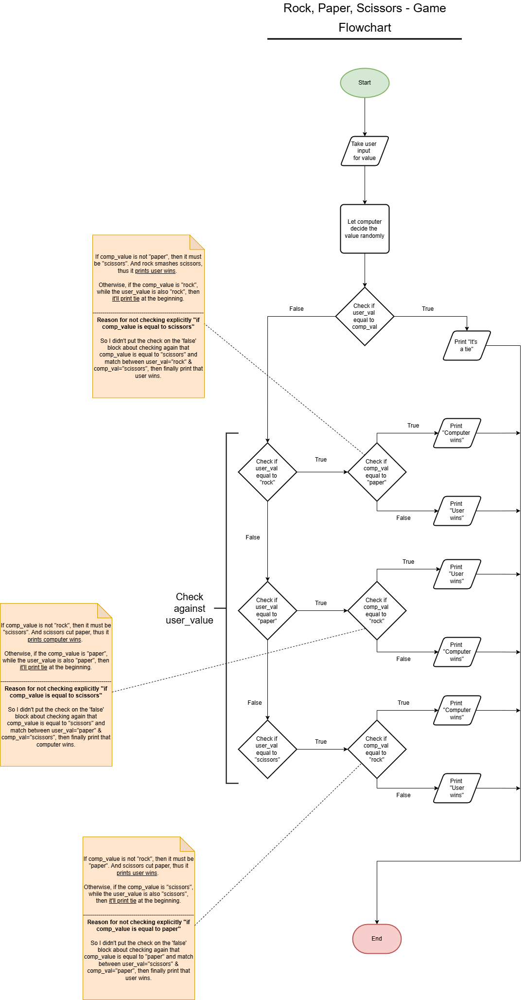

# Algorithm

1. Take user input for value from a certain list of rock-paper-scissors.
   - Validate the value of user input against the certain list.
2. Let computer select a value from that certain list randomly.
3. Implement the conditional check algorithm of computer-selected-value against user-inserted-value.
   - If the user_val & the comp_val is equal, then the program prints "It's a tie" in the console.
   - Check if user_val="rock" and
     - If comp_val="paper", then print "Computer wins".
     - Else (comp_val must be "scissors") print "User wins".
   - Check if user_val="paper" and
     - If comp_val="rock", then print "User wins".
     - Else (comp_val must be "scissors") print "Computer wins".
   - Check if user_val="scissors" and
     - If comp_val="rock", then print "Computer wins".
     - Else (comp_val must be "paper") print "User wins".

# Flowchart

# Key Takeaways

1. Variable assignment.
2. Take user-input through console.
3. Define functions w/ parameter & invoke them.
4. Nested `if-else` condition.

# Resources

1. [YT] [Python for Beginners – Full Course [Programming Tutorial]](https://youtu.be/eWRfhZUzrAc?si=k5R53jt7AzS7CYRF)
